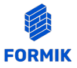
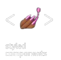

# 🖥️  Dumas

## 📜 Descrição

 Bem-vindo ao Dumas.

No Dumas, mergulhe em uma experiência gastronômica única e memorável, inspirada na camaradagem e na paixão por pratos excepcionais. Nosso nome é uma homenagem aos lendários Três Mosqueteiros, mas nossa história é ainda mais cativante.  

O Dumas nasceu quando um de nossos amigos se despediu, deixando-nos como um trio e nos intitulamos "Os três Mosqueteiros". Foi então que descobrimos que Alexandre Dumas, o ilustre autor, também compartilhava uma paixão pela culinária. A sincronicidade nos surpreendeu, e decidimos adotar o nome "Dumas" como símbolo da nossa amizade, aventura e amor pela boa comida.

Navegue pelo Dumas e descubra uma seleção exclusiva de pratos preparados por chefs renomados que estão mais próximos de você. Deleite-se com criações extraordinárias e mergulhe no universo da alta gastronomia como nunca antes. Guarde seus pratos favoritos na lista de favoritos para revivê-los sempre que desejar.

No Dumas, personalize sua experiência ao alternar entre temas de light e dark, tornando o site perfeito para você. Além disso, aprimore seu perfil para tornar sua jornada conosco ainda mais especial.

Compartilhe suas opiniões e avaliações sobre os pratos e restaurantes que experimentar. Sua voz é fundamental para ajudar outros amantes da culinária a descobrir verdadeiros tesouros gastronômicos.

Estamos entusiasmados em compartilhar nossa paixão pela culinária e pela história por trás do nosso nome com você. Explore, saboreie e descubra no Dumas.

## 🔗 Links Úteis

  <a href="https://www.figma.com/file/LK8CW3OQ04g5UVSDFVaeq2/teste1?type=design&node-id=0-1&mode=design&t=hxOZ7ETVxXjpEnhW-0" target= "_blank">Design Figma</a>  

## 📋 Guia de Padronização

- Será usado versão 18 do node;
- Nomes de variáveis e funções devem seguir o padrão camelCase;
- Valores imutáveis devem seguir o pradrão SNAKE_UPPERCASE_WITH;
- Apenas um component react por arquivo, sem uso de export default;
- Arquivos e pastas devem seguir o padrão camelCase;
- Components devem estar numa pasta com o nome do component em PascalCase;
- A pasta do componente terá: index.tsx - arquivo do componente, styled.ts - syled-component, component.test.ts - arquivo de teste;
- Quando o componente necessitar de mais de uma tipagem, colocar as tipagens num arquivo chamado types.ts dentro da pasta do componente;
- Tipagem de props deve seguir o padrao ComponentNameProps;
- Todos os arquivos deverão estar nas suas devidas pastas, conforme está estruturado o repositório;
- Todo o código-fonte deve ser escrito em inglês. Isso inclui nomes de variáveis, funções, classes, etc;
- Todos os commits devem seguir a  convenção de commits semânticos no tempo presente, ex: "adiciona tal funcionalidade";

## 🎲 Tecnologias e Bibliotecas 

    axios: 1.5.0,
    formik: 2.4.4,
    react-icons: 4.11.0,
    react-modal: 3.16.1,
    react-qr-code: 2.0.12,
    react-query: 3.39.3,
    react-router-dom: 6.16.0,
    react-secure-storage: 1.3.0,
    react-toastify: 9.1.3,
    styled-components: 6.0.8,
    yup: 1.2.0,
    cypress: 13.3.0,
    eslint: 8.45.0

## 🔧 Funcionalidades

### 🔓 Área de Usuários não Logados:

#### Autenticação:

- Login
- Sign up (Registro)
- Autocompletar o endereço
- Validação de formulário
- Recuperação de senha

### 🔒 Área do Usuário logado (Consumidor):

- Aqui fica a critério de cada grupo a quantidade de telas. Devem existir telas de: Home, Carrinho e Prato.
- Home
- Carrinho
- Página de descrição do prato
- Lista de pratos próximos
- Lista de pratos
- Lista de favoritos
- Página de perfil e edição de perfil do usuário

#### Home:

- Lista de pratos/chefs próximos
- Mapa com a localização do usuário e chefs próximos
- Lista infinita de outros pratos disponíveis
- Ícone para o carrinho de compras
- Lista de pratos favoritos
- Barra de Pesquisa por chefs e pratos.

#### Edição do Usuário:

- Edição de nome e email
- Adição e edição de endereços
- Adição e edição de números de telefone

#### Carrinho:

- Simulação de checkout com opções de pagamento (QR code)
- Escolha ou adição de endereço
- Opção de retirada de produto do Carrinho

#### Página de Detalhes do Produto:

- Informações: Nome do prato, nome do chef, descrição, adição ao carrinho, preço
- Mapa interativo exibindo a distância entre o usuário e o chef/prato
- Avaliação em forma de nota ou estrelas
- Opção de "like" e "dislike" no prato
- Lista de pratos do mesmo chefe

## Instalando e executando o Projeto

### Clonar o Projeto

      https://git.raroacademy.com.br/francisco.jefferson/projeto-final.git

### Acesse a pasta do projeto no terminal/cmd

      cd projeto-final

### Instalar dependências

      npm install

### Execute a aplicação em modo de desenvolvimento

      npm run dev

## 💻 Telas

## 👩‍💻 Desenvolvedores

<table align="center">
   <tr>
    <td align="center">
      

         
          <b> Carolina Alves Ribeiro </b> 
          <b> Desenvolvedora Web Frontend / Head de Design </b> 
            

  </tr>

  </tr>

  <tr>
    <td align="center">
      

          
          <b> Francisco Jefferson Ferreira de Lima </b> 
          <b> Desenvolvedor Web Frontend / Tech Lead </b> 
            
            

  </tr>

  <tr>
    <td align="center">
      

         
          <b> Karine Pereira </b> 
          <b> Desenvolvedora Web Frontend / P.O. </b> 
            

  </tr>

</table>
